<div align="center">

# Sutra

### Split it before you pay it.

**Group checkout for agents and humans: one decision, one capped approval per person, no pooled wallet.**

[Open Sutra](https://sutra-gmp.vercel.app) · [Pitch deck](https://sutra-gmp.vercel.app/deck) · [NANDA proof](https://sutra-gmp.vercel.app/nanda) · [Protocol](spec/PROTOCOL.md) · [API reference](docs/REFERENCE.md)

Built on [Prava](https://docs.prava.space) for the Agentic Commerce Hackathon · team `__init__ to win it`

</div>


Sutra coordinates a purchase before money moves. A group starts with a sentence, a product link, or a restaurant bill; Sutra collects everyone's constraints, calculates exact shares, and asks each person to consent to only their own amount.

The payment primitive underneath is **GMP/1, the Group Mandate Protocol**: N principals, N independently capped mandates, one group policy, one signed terminal receipt. Sutra never stores a pooled balance and never sees a card number.

## The problem

Today, "group payment" usually means one person becomes the lender: they place the order on one card, then chase everyone else afterward. Agentic payment protocols inherit the same assumption — one user authorizes one agent — so they can describe a group purchase, but the payment layer still sees a single principal. Sutra adds the missing coordination layer without turning the organizer, or the agent, into a wallet.

```mermaid
flowchart LR
    A["Sentence · link · bill"] --> B["Interpret facts and ask the group"]
    B --> C["Rank options and calculate exact shares"]
    C --> D["Freeze cart hash · cap · policy"]
    D --> E["Each person approves their own share"]
    E --> F["GMP/1 decision + commit saga"]
    F --> G["Prava · Shopify POS · checkout handoff · at venue"]
    G --> H["Ed25519-signed, hash-chained receipt"]
```



Every payer sees their items, share, cap, merchant, and cart hash before approving. Sutra then uses whatever capability the merchant actually has — a Prava adapter may charge; Shopify POS, checkout handoff, and at-venue flows record agreement and explicitly report zero charged by Sutra — and every terminal group produces a receipt whose consent chain verifies without trusting the UI.

## What the product does

One sentence becomes typed intent, participant questions, real OpenStreetMap venues, and an explainable ranked shortlist — deterministic rules are always the fallback, and never invent a venue or a price. A product URL or a search across configured Shopify storefronts resolves to a verified merchant, price, and stock state before anyone is seated in a group; an authenticated cart on another site comes in through the click-invoked browser extension. A photographed or pasted bill reconciles against its printed total, item by item, and stops rather than guesses when the arithmetic doesn't add up — this is the **at-venue rail**: it records who owes what and never charges a card. Every approval page carries the whole decision — share, items, policy, deadline, and the rail-specific consequence — with payment consent kept separate from planning answers. The shipped web/PWA also has accounts, friends, circles, a live group thread with an `@sutra` bot, notifications, a dashboard for pending decisions and card exposure, receipts, and the extension.


## The money boundary

| Situation | What Sutra completes | What it does **not** claim |
|---|---|---|
| Merchant with a real Sutra/Prava adapter | One hosted mandate session per payer, then person-scoped charges once each approves | That a merchant URL alone proves adapter support |
| Configured Shopify development store | After **test** approvals, one valid Shopify order with `test: true` and one labeled test transaction per participant | Real money, multi-card Shopify Checkout, or a production integration |
| Confirmed Shopify POS counter | Records each exact share, hands the cashier a clear split-payment total | That Sutra connects to the terminal or observes the POS payment |
| Shopify/public product, no adapter | Preserves live product facts and coordinated shares, returns the group to merchant checkout | That Sutra placed the order — address, shipping, tax, and payment stay at checkout |
| Physical restaurant/bar bill | Reconciles the bill and signs a receipt with `owed_amount > 0`, `charged_amount = 0` | That Sutra paid the venue |

A shared online checkout becomes fully automatic only once a merchant supports split tender or an adapter can reconcile individual credentials — designed in [`spec/PROTOCOL.md`](spec/PROTOCOL.md), not a shipped claim.

As of **August 2, 2026**, the deployed engine is connected to the Shopify development store `sutra-agzdw2mf.myshopify.com`, with three published demo products and `/v1/shopify-test/status` reporting the adapter ready while Prava runs in sandbox mode. The judgeable flow: pick a real product, run a two-person split, each person approves their capped Prava sandbox mandate, the group commits, then Sutra creates one Shopify **TEST** order you can open in Shopify Admin next to its one labeled test transaction per participant. Real merchant-record integration evidence — still test infrastructure, no real money, and Shopify Checkout itself never collects multiple cards.

## Why the engine is difficult

Card charges don't roll back like database rows, so GMP/1 is a crash-resumable commit saga, not a happy path with a try/catch around it. There is no wallet, balance, or ledger table anywhere in the schema. Consent can't stretch — cart hash and cap are part of what was approved, and a larger share needs fresh consent. A definite refusal from the payment provider is never retried; an unknown result is never treated as a failure, and the engine asks the provider for its own idempotency reference before deciding anything. Attempt references survive a restart, reconstructed from the append-only event log, so nothing gets silently charged twice. A mixed, irreversible outcome is reported as `partial`, never manufactured into a false "atomic" success. And a receipt on a non-charging rail that claims a charge fails its own verification. Commit policies include `all_of`, quorum, weighted threshold, veto, required members, and deadline fallback, with payer, sponsor, backstop, and observer roles — the full state machines live in [`spec/PROTOCOL.md`](spec/PROTOCOL.md).

## Project NANDA: a payment adapter, not another ledger

[`nanda-town-prava/`](nanda-town-prava/) is a real NANDA Town `payments` plugin, registered as `prava_mandates` under `nest.plugins.payments`, replacing the simulator's pooled `prepaid_credits` model with merchant-scoped, capped authorization headroom.

| | `prepaid_credits` | `prava_mandates` |
|---|---|---|
| Value model | Internal pooled balances | Each principal's own card authorization |
| `pay()` | Debit one agent, credit another | Create/execute a merchant payment mandate |
| Payee | Another simulator agent | An external merchant |
| Group purchase | No multi-principal primitive | `pay_group()` binds N mandates to one policy |
| Agent-to-agent transfer | Supported | Deliberately impossible on this rail |

```bash
npm run nanda:scene
```

discovers the installed plugin through Python entry-point metadata, runs a four-agent purchase with a mid-flight decline and backstop, checks conservation invariants, and compares the same scenario against `prepaid_credits`. Simulated receipts are marked `simulated: true`; live mode requires a real human approval and never impersonates one. Submitted upstream as [`projnanda/nandatown#210`](https://github.com/projnanda/nandatown/pull/210). Full evidence: [`docs/NANDA.md`](docs/NANDA.md).

## Run it locally

Requires Node.js 22.5+.

```bash
npm install
cp .env.example .env     # optional; defaults use SQLite + mock Prava
npm run dev              # web :3000 · engine :4100
npm run demo             # in another terminal: four approvals → commit → verified receipt
```

`npm run demo` looks for an engine at `localhost:4100` first, and starts one itself if `npm run dev` isn't already running — the two commands work in either order.

```bash
npm test -w engine       # protocol, API, integrations, failure semantics
npm run test:widget      # detector shared by widget/bookmarklet/extension
npm run build             # production Next.js build + type checking
npm run nanda:test       # Python adapter suite
```

The default demo is offline and reproducible on purpose. Real Prava sandbox approval requires a human to complete the hosted passkey ceremony — automation must not approve a mandate on someone's behalf.

## Current limits, plainly

A real, human-approved Prava sandbox charge is now documented: group `gs_01KZ1SW0EXN2V3N4Y1V0K5E4H4`, Velvet Sessions — Group Pass, ₹18,600 from the configured Shopify development store, split ₹9,300 between two participants who each approved their own capped Prava mandate on a separate device with the team's shared Prava test card — two independent human approvals and two person-scoped mandates, not two different physical cardholders. Rail `prava_mandates`, status `committed`, both entries `charged`, charged sequentially with idempotent recovery, never atomically. It is sandbox money, not real money, and it does not reach the Shopify store — the Shopify test order is a merchant record, not a settlement. Verify it yourself:

```bash
curl -s https://sutra-gmp.vercel.app/api/v1/groups/gs_01KZ1SW0EXN2V3N4Y1V0K5E4H4/receipt > receipt.json
npm run -w cli gmp -- verify receipt.json --engine https://sutra-gmp.vercel.app/api
```

That does not change the standing limitation below: Sutra does not place an ordinary shared merchant order when the checkout accepts only one card. Shopify POS is a cashier handoff, not a terminal integration. The restaurant-bill rail records agreement and exact debt but never charges the venue. Post-capture refunds are not supported on any rail today — the remedy is a merchant-initiated refund or a cardholder chargeback. The Chrome extension is load-unpacked only, not in the Web Store. The production engine is a durable single-writer SQLite deployment, not a horizontally scaled service. Native mobile apps are roadmap work; the responsive PWA is what ships now.

The full built/partial/not-built inventory is in [`docs/ARCHITECTURE.md`](docs/ARCHITECTURE.md) §12.

## Documentation

| Read this | When you need |
|---|---|
| [`docs/EXPLANATION.md`](docs/EXPLANATION.md) | The zero-knowledge explainer, no prior payments or agent-protocol knowledge assumed |
| [`spec/PROTOCOL.md`](spec/PROTOCOL.md) | GMP/1 objects, policies, state machines, commit saga, rails, receipts |
| [`docs/ARCHITECTURE.md`](docs/ARCHITECTURE.md) | Code-level map, the coordination layer, the delegate mesh, and the Shopify boundary — all checked against the source |
| [`docs/REFERENCE.md`](docs/REFERENCE.md) | Endpoint inventory, failure taxonomy, built-vs-designed claims |
| [`docs/NANDA.md`](docs/NANDA.md) | NANDA plugin evidence, baseline diff, registry status |
| [`docs/RUNBOOK.md`](docs/RUNBOOK.md) | Local operation, deployment, keys, recovery, production invariants |
| [`docs/TRACK-EVIDENCE.md`](docs/TRACK-EVIDENCE.md) | Track-by-track judging evidence, sourced to a file, line, or live URL |
| [`docs/BUSINESS-CASE.md`](docs/BUSINESS-CASE.md) | The commercial argument: unit economics, the wedge, and what would kill it |

## Team

Built by **Soham Aggarwal and Arshjeet** as team `__init__ to win it` for the Agentic Commerce Hackathon, August 2026.

The project's standard is simple: if money did not move, the product, receipt, README, and demo must all say so.
