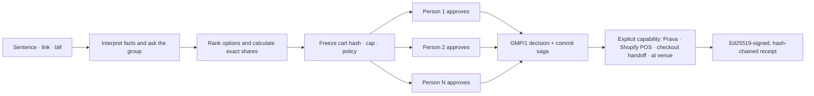
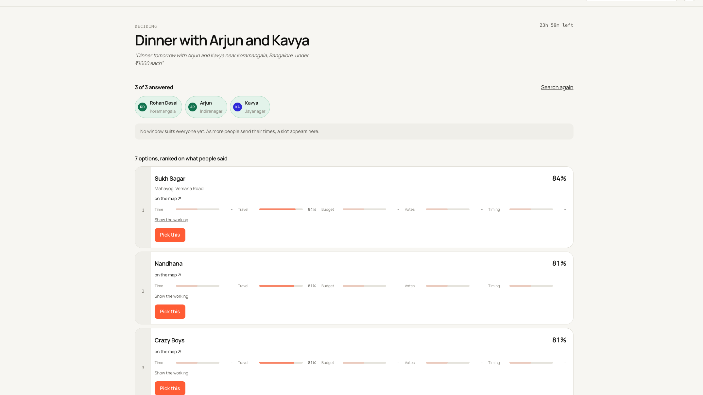
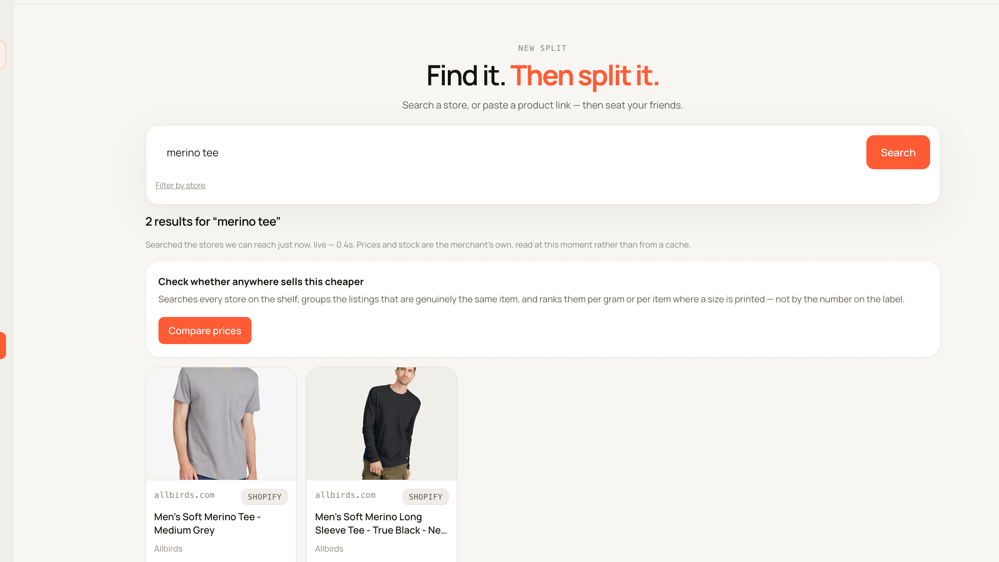
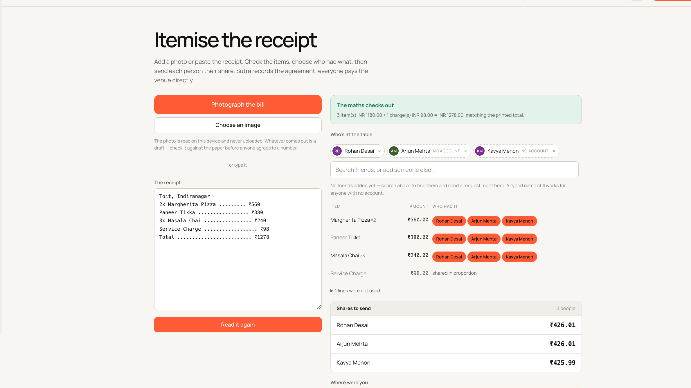
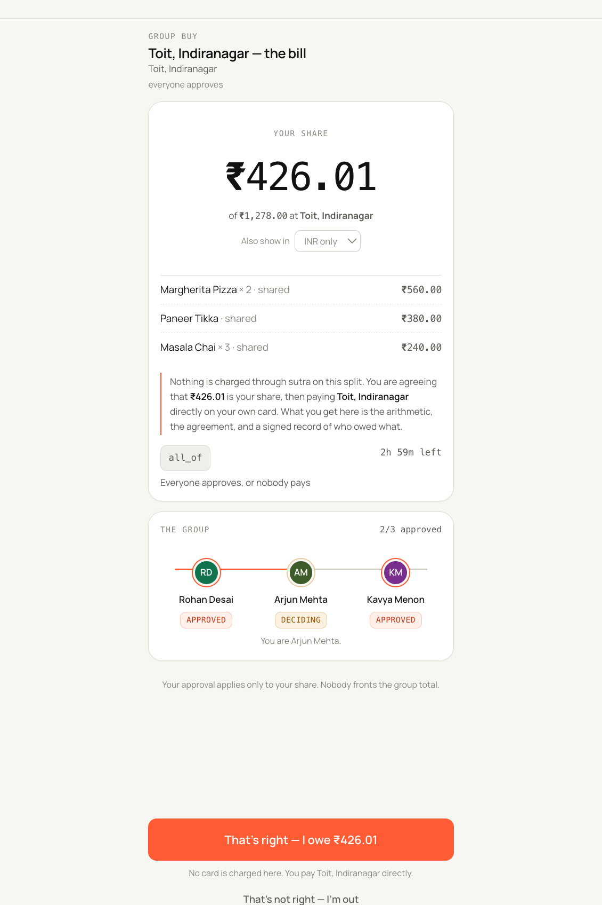
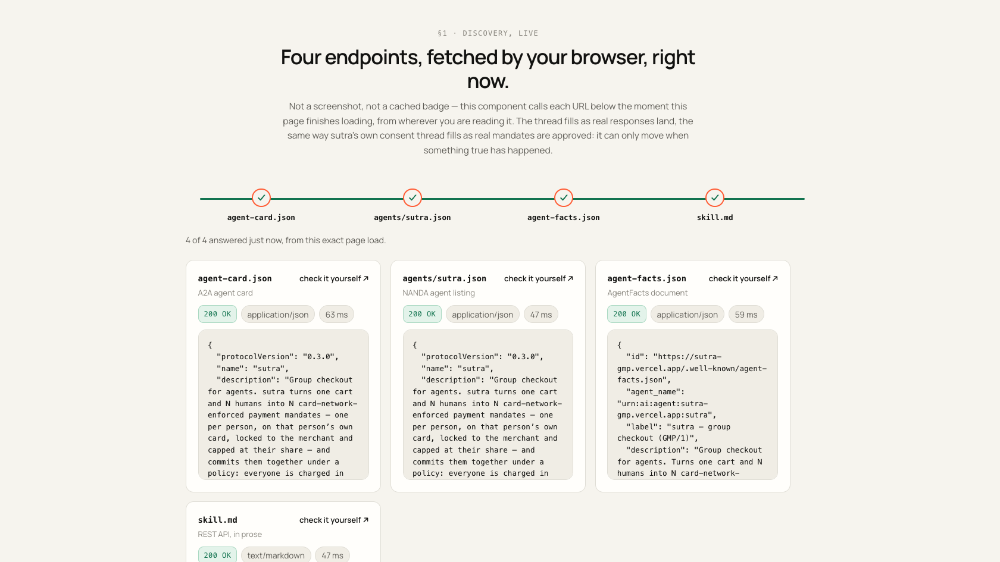

<div align="center">

# Sutra

### Split it before you pay it.

**Group checkout for agents and humans: one decision, one capped approval per person, no pooled wallet.**

[Open Sutra](https://sutra-gmp.vercel.app) · [NANDA proof](https://sutra-gmp.vercel.app/nanda) · [Protocol](spec/PROTOCOL.md) · [API reference](docs/REFERENCE.md)

Built on [Prava](https://docs.prava.space) for the Agentic Commerce Hackathon · team `__init__ to win it`

</div>


Sutra coordinates a purchase before money moves. A group can begin with a sentence, a product link, or a restaurant bill; collect everyone’s constraints; calculate exact shares; and ask each person for consent to only their own amount.

The payment primitive underneath is **GMP/1, the Group Mandate Protocol**: N principals, N independently capped mandates, one group policy, and a signed terminal receipt. Sutra never stores a pooled balance and never sees a card number.

## The problem

Today, “group payment” usually means one person becomes the lender. They place the order on one card, send requests afterwards, and absorb the risk when somebody forgets or declines.

Agentic payment protocols inherit the same assumption: one user authorizes one agent. They can describe a group purchase, but the payment layer still sees one principal. Sutra adds the missing coordination layer without turning the organizer—or the agent—into a wallet.

## From intent to consent



1. **Bring the context.** Describe a plan, paste a public product page, or enter a bill.
2. **Ask, don’t assume.** Every participant gets a private link for availability, location, budget, RSVP, and constraints. These answers cannot authorize payment.
3. **Make the decision inspectable.** Real venues come from OpenStreetMap; product facts retain their source; rankings expose their factors; bill arithmetic must reconcile.
4. **Bind consent to the exact thing.** Each payer sees their items, share, cap, merchant, policy, and cart hash before approving.
5. **Use the capability the merchant actually has.** A Prava adapter may charge. Shopify POS, checkout handoff, and at-venue flows record agreement and explicitly report zero charged by Sutra.
6. **Leave evidence.** Every terminal group produces a signed receipt whose consent chain can be verified without trusting the UI.

## What the product does

### Plan with the group, not around them

One sentence becomes typed intent, participant questions, real OpenStreetMap venues, common time windows, and an explainable shortlist. OpenAI can help extract intent, but deterministic rules remain the fallback and never invent venue or payment facts.



### Resolve a product, then verify it

Open a live Shopify shelf, search any configured Shopify storefront, or paste an exact public product URL. Sutra preserves merchant, price, currency, stock state, source, and resolution confidence before anyone is seated in the group. Authenticated carts from other sites come through the click-invoked extension.



### Turn a bill into exact, reviewable shares

Paste receipt text—or use vision when configured—then reconcile parsed lines against the printed total. Assign items, distribute fees in minor units, and stop when the arithmetic or OCR integrity check is suspicious. This is the **at-venue rail**: it records who owes what; it does not charge a card.



### Give every person one clear decision

The approval surface contains the whole decision: exact share, items, group policy, progress, deadline, and the rail-specific consequence. Payment consent is separate from planning answers.

<p align="center">
  
</p>

### Operate as a real group product

The shipped web/PWA also includes accounts, friends, circles, pass-the-phone participation, private invite links, a live group thread with an `@sutra` state bot, notifications, a dashboard for pending decisions and card exposure, receipts, and an unpacked Chrome extension for importing the current merchant page.

## The money boundary

Sutra does not pretend every split has the same settlement capability.

| Situation | What Sutra completes | What it does **not** claim |
|---|---|---|
| Merchant with a real Sutra/Prava payment adapter | Creates one hosted mandate session per payer, waits for each person’s passkey approval, then executes the group policy through person-scoped charges | That a merchant URL alone proves adapter support |
| Configured Shopify development store | After Sutra/Prava **test** approvals, creates one valid Shopify order with `test: true`, a fictional delivery address, and one visibly labeled test transaction per participant | Real money, multi-card Shopify Checkout, or a production merchant integration |
| Confirmed Shopify POS counter | Records each exact agreed share, then gives the cashier a clear split-payment handoff | That Sutra connects to the terminal or that its signed agreement proves the POS payment |
| Shopify/public online product without an adapter | Preserves live product facts, coordinates shares, and returns the group to merchant checkout | That Sutra placed the order; delivery address, shipping, tax and payment remain at checkout |
| Physical restaurant/bar bill | Reconciles the bill, captures exact agreement, and signs a receipt with `owed_amount > 0` and `charged_amount = 0` | That Sutra paid the venue |

A shared online checkout becomes fully automatic only when the merchant supports split tender or a merchant adapter can reconcile the individual payment credentials. That protocol extension is designed in [`spec/PROTOCOL.md`](spec/PROTOCOL.md); merchant adoption is not a shipped claim.

## Why the engine is difficult

The happy path is not the differentiator. Card charges do not roll back like database rows, so GMP/1 is a crash-resumable commit saga built around evidence:

- **No pooled funds:** there is no wallet, balance, or ledger table in the engine schema.
- **Consent cannot stretch:** cart hash and cap are part of the approved object; a larger share requires fresh consent.
- **Definite refusal is not retried:** a terminal provider response closes that attempt.
- **Unknown is not failure:** after a lost response, the engine asks the provider for the idempotency reference before it considers retrying.
- **No silent double charge:** attempt references survive restart and are reconstructed from the append-only event log.
- **Partial means partial:** if an irreversible mixed outcome occurs, the receipt reports it instead of manufacturing “atomic” success.
- **At-venue never says charged:** receipt verification rejects a non-charging rail that claims money moved.

Commit policies include `all_of`, quorum, weighted threshold, veto, required members, and deadline fallback. Roles include payer, sponsor, backstop, and observer. The exact state machines and failure semantics live in the [GMP/1 specification](spec/PROTOCOL.md).

## Project NANDA: a payment adapter, not another ledger

[`nanda-town-prava/`](nanda-town-prava/) is a real NANDA Town `payments` plugin registered as `prava_mandates` under `nest.plugins.payments`. It replaces the simulator’s pooled `prepaid_credits` model with merchant-scoped, amount-capped authorization headroom.

| | `prepaid_credits` | `prava_mandates` |
|---|---|---|
| Value model | Internal pooled balances | Each principal’s own card authorization |
| `pay()` | Debit one agent, credit another | Create/execute a merchant payment mandate |
| Human authorization | Process-controlled | Hosted approval + passkey in live mode |
| Payee | Another simulator agent | External merchant |
| Group purchase | No multi-principal primitive | `pay_group()` binds N mandates to one policy |
| Agent-to-agent transfer | Supported | Deliberately impossible on this rail |



Run the narrated, self-grading comparison with no keys or network:

```bash
npm run nanda:scene
```

The scene discovers the installed plugin through Python entry-point metadata, runs a four-agent purchase with a mid-flight decline and backstop, checks conservation invariants, and compares the same scenario with `prepaid_credits`. Simulated receipts are marked `simulated: true`; live mode requires human approval and never impersonates it. See the [plugin README](nanda-town-prava/README.md) and [evidence pack](docs/NANDA-EVIDENCE.md).

## Architecture

| Layer | Responsibility | Primary code |
|---|---|---|
| Web / PWA | Planning, discovery, people, approvals, dashboard, receipts | [`web/`](web/) |
| Coordination | Intent extraction, participant signals, time/geo math, explainable ranking | [`engine/src/plan/`](engine/src/plan/) · [`engine/src/agent/`](engine/src/agent/) |
| Commerce intake | URL resolution, public catalogs, bill parsing and integrity checks | [`engine/src/catalog/`](engine/src/catalog/) · [`engine/src/bill/`](engine/src/bill/) |
| GMP/1 engine | Share allocation, policies, mandate lifecycle, commit/recovery, receipts | [`engine/src/service.ts`](engine/src/service.ts) · [`engine/src/protocol/`](engine/src/protocol/) |
| Payment adapters | Real Prava REST client, local mock, fault-injection proxy | [`engine/src/prava/`](engine/src/prava/) |
| Agent surfaces | MCP server, A2A AgentCard, AgentFacts, SkillMD, AI catalog | [`mcp/`](mcp/) · [`engine/src/discovery/`](engine/src/discovery/) |
| Merchant-page intake | Shared detector, bookmarklet, unpacked extension | [`widget/`](widget/) · [`extension/`](extension/) |
| NANDA Town | Python `payments` plugin and simulator-compatible protocol adapter | [`nanda-town-prava/`](nanda-town-prava/) |

The engine is intentionally one persistent process today: SQLite, the approval poller, SSE fan-out, and the in-process event hub depend on a single replica. Deployment invariants are documented in the [runbook](docs/RUNBOOK.md).

## Run it locally

Requires Node.js 22.5+.

```bash
npm install
cp .env.example .env     # optional; defaults use SQLite + mock Prava
npm run dev              # web :3000 · engine :4100
```

In another terminal:

```bash
npm run demo             # four approvals → commit → verified receipt
```

Useful verification commands:

```bash
npm test -w engine       # protocol, API, integrations, failure semantics
npm run test:widget      # detector shared by widget/bookmarklet/extension
npm run build            # production Next.js build + type checking
npm run nanda:test       # Python adapter suite
npm run nanda:scene      # narrated NANDA differentiator
```

The default demo is deliberately offline and reproducible. Real Prava sandbox approval requires a human to complete the hosted passkey ceremony; automation must not approve a mandate on someone’s behalf.

## Current limits—plainly

- No completed, human-approved Prava sandbox card charge is documented in this repository yet. Real mandate-session creation is integrated; do not describe that as settled money.
- Sutra does not place an ordinary shared merchant order when the checkout accepts only one card.
- Shopify POS is a cashier handoff today, not a direct terminal integration. Merchant/POS receipts—not Sutra’s agreement receipt—prove payment.
- The configured development-store proof accepts a fictional address in Sutra and writes a `test: true` Shopify order. On ordinary online handoff, address, shipping, tax and final payment remain at Shopify checkout.
- The restaurant-bill rail records agreement and exact debt but never charges the venue.
- Photo OCR runs on-device by default. Upload to a configured vision service requires an explicit disclosed click; pasted bill text and all arithmetic are deterministic.
- Catalog coverage is best-effort over public data. Authenticated carts and heavily client-rendered pages require the extension or a merchant integration.
- Venue search depends on public OpenStreetMap services and can time out under load.
- The Chrome extension is load-unpacked only; it is not in the Web Store.
- The production engine is a durable single-writer SQLite deployment, not a horizontally scaled service.
- Native mobile apps are roadmap work; the responsive PWA is what ships now.

The detailed built/partial/not-built inventory is in [`docs/PRODUCT_AND_MOBILE_ROADMAP.md`](docs/PRODUCT_AND_MOBILE_ROADMAP.md).

## Documentation

| Read this | When you need |
|---|---|
| [`spec/PROTOCOL.md`](spec/PROTOCOL.md) | GMP/1 objects, policies, state machines, commit saga, rails, receipts |
| [`docs/COORDINATION.md`](docs/COORDINATION.md) | Signal model, common-window math, geo model, ranking arithmetic |
| [`docs/REPO-MAP.md`](docs/REPO-MAP.md) | Code-level map with concrete implementation references |
| [`docs/REFERENCE.md`](docs/REFERENCE.md) | Endpoint inventory, failure taxonomy, built-vs-designed claims |
| [`docs/PRODUCT_ARCHITECTURE.md`](docs/PRODUCT_ARCHITECTURE.md) | Web, extension, merchant checkout, accounts, and mobile boundaries |
| [`docs/NANDA-EVIDENCE.md`](docs/NANDA-EVIDENCE.md) | NANDA plugin transcripts, baseline diff, registry evidence |
| [`docs/RUNBOOK.md`](docs/RUNBOOK.md) | Local operation, deployment, keys, recovery, production invariants |
| [`docs/HACKATHON.md`](docs/HACKATHON.md) | Track positioning, judging evidence, submission checklist |

## Team

Built by **Soham Aggarwal and Arshjeet** as team `__init__ to win it` for the Agentic Commerce Hackathon, August 2026.

The project’s standard is simple: if money did not move, the product, receipt, README, and demo must all say so.
