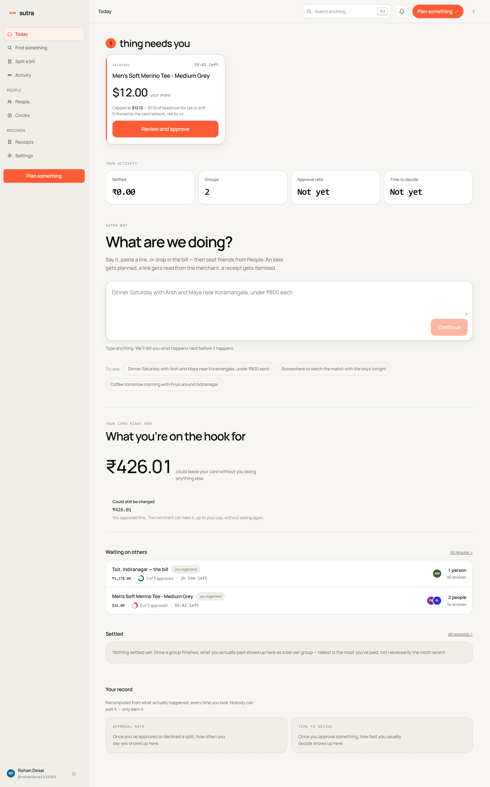
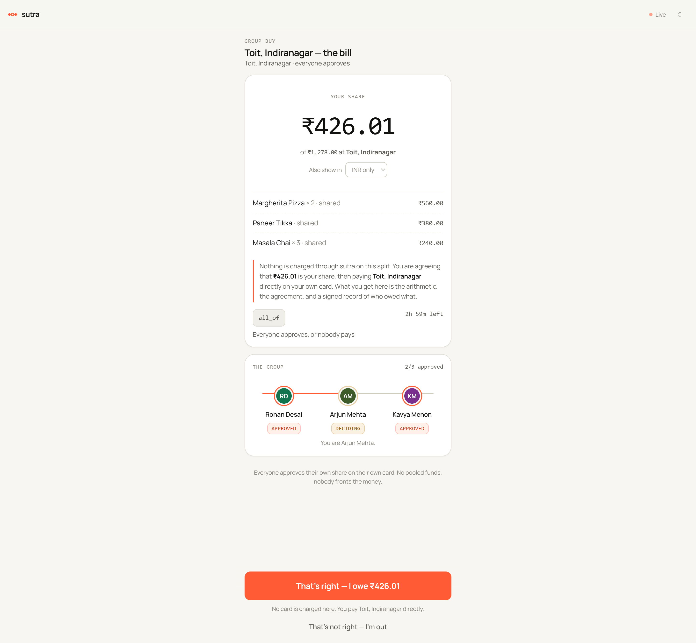
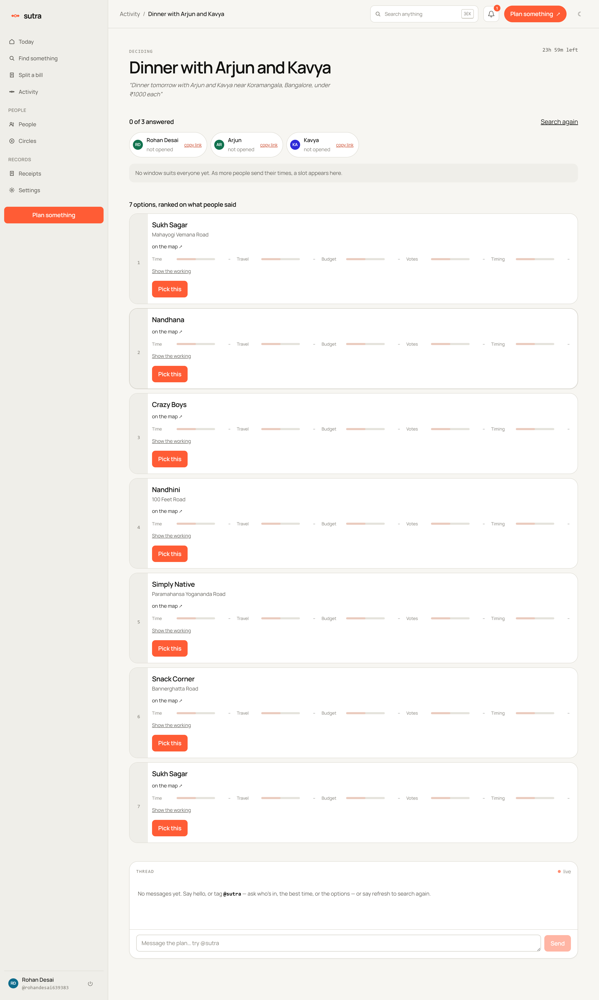
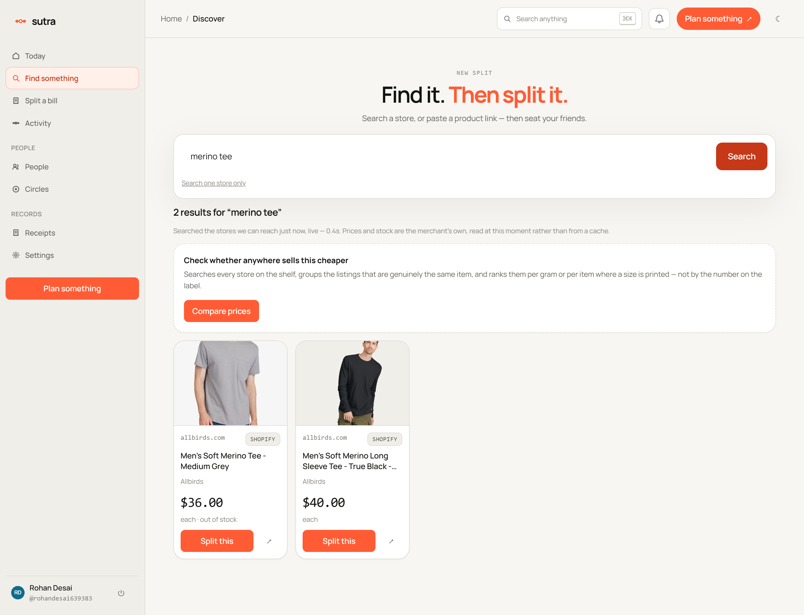
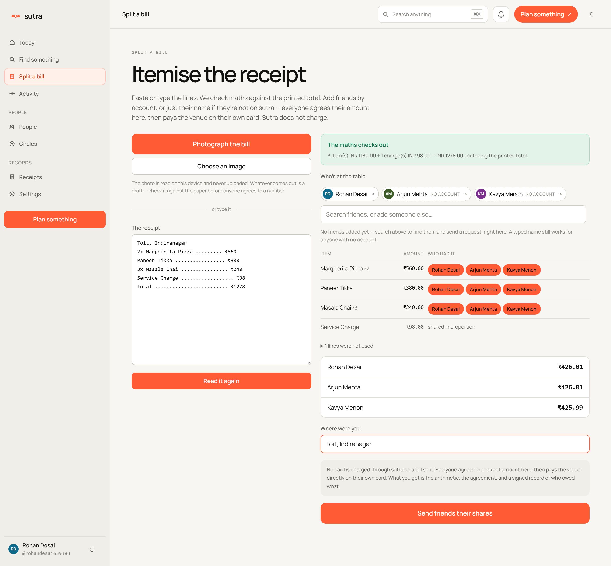
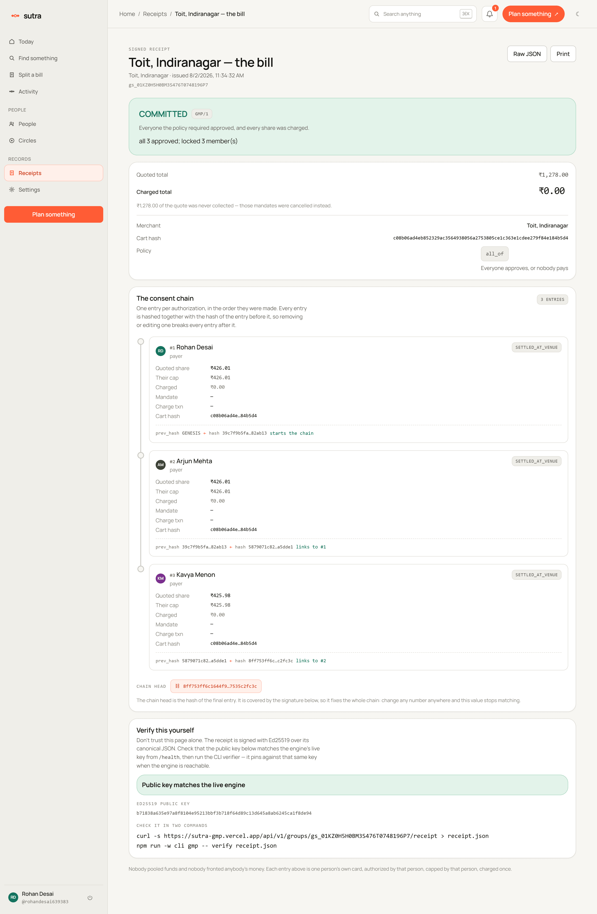

# sutra — one cart, everyone's own card, nobody fronts the money

sutra lets a group pay for one thing together without one person's card taking
the whole hit. Each person approves a permission capped at their own share, on
their own card — and either everyone gets charged at once, or nobody does.

Live product: **[sutra-gmp.vercel.app](https://sutra-gmp.vercel.app)** ·
Live engine: **[engine-production-e6fa.up.railway.app/health](https://engine-production-e6fa.up.railway.app/health)**
· Built on [Prava](https://docs.prava.space) · Team `__init__ to win it`
(Soham + Arshjeet), Agentic Commerce Hackathon, Aug 2026.



## The problem

Somebody pays first, then spends a fortnight asking for it back. One person's
card takes the group order — the shared cart, the concert tickets, the
restaurant bill — and then they chase four Venmo requests, guess who forgot,
and eat the balance of whoever ghosts. Every online checkout assumes exactly
one payer says yes. A group almost never is one person.

## How it actually works

1. Someone starts a group buy — a cart, a bill, or a plan that turns into one.
2. Everyone approves their own **mandate**: a permission capped at their own
   share, on their own card, with their own passkey. Nothing is charged yet.
3. Once the group's rule is satisfied — everyone approved, a quorum, whatever
   the group picked — every approved card is charged **at once**, in one step.
4. If the rule can't be met — someone declines, the deadline passes — every
   mandate is **cancelled** instead. No partial charges, nobody left exposed.
5. A signed, hash-chained receipt records exactly who was asked, who approved,
   and what — if anything — actually moved.

No balance is ever held by sutra. There is no such column in the schema.



## What it does

**Planning.** One sentence — *"dinner saturday near Koramangala, under 900
each"* — becomes real venues from OpenStreetMap, ranked against everyone's
answers with a score you can read the reasons for, not just trust.



**Paste a link, split it.** Paste a product URL or search a catalog; sutra
resolves it to a priced line and figures out whether it's a whole-cart split
or everyone buying their own thing (see *the honest boundary* below).



**Bill splitting.** Photograph or paste a restaurant bill. It's parsed,
reconciled against the printed total — a mismatch is reported, never papered
over — and split into exact shares down to the minor unit.



**The browser extension.** Import whatever product page you're looking at
into a group cart. It's "load unpacked" only — not on the Chrome Web Store yet.

**Group thread, with `@sutra`.** Message the group about the plan; tag
`@sutra` and it answers from the group's real state. It never authors a fact
and refuses anything payment-shaped.

**Receipts.** Every commit produces an Ed25519-signed, hash-chained receipt
you can verify offline, without trusting our server.



## The honest boundary

A Prava charge mints **one single-use card per person**, locked to a merchant
and capped at that person's own share. Four people means four card numbers —
and a normal checkout has one card field. That works cleanly in two shapes,
and breaks in a third:

|  | Everyone buys their own item | Paying in person | One shared cart, split online |
|---|---|---|---|
| Example | four tickets, one each | a restaurant bill, a bar tab | one Amazon cart, four people |
| Completes today? | yes, unassisted | yes — sutra does the arithmetic, people hand over cards at the till | **no** |
| Why | each card covers exactly one whole order | any till has always taken more than one card | the merchant's checkout has one card field, and cannot take four |

**sutra does not place the merchant order for a shared cart.** Doing that
needs the merchant to accept more than one card for one order — split tender
— which is routine at a physical till and rare online. sutra detects which of
these three situations a cart is actually in from what people claimed, rather
than guessing, and says so before anyone approves anything — see
[`web/src/components/discover/how-it-completes.tsx`](web/src/components/discover/how-it-completes.tsx).
Every charge in a group already carries a shared reference a Prava-aware
merchant could reconcile split-tender against; that is a proposal in
`spec/PROTOCOL.md`, not a shipped feature, and no merchant has adopted it.

## Try it in 60 seconds

```bash
npm install
cp .env.example .env      # optional — every value has a working default (mock Prava, SQLite)
npm run dev                # engine on :4100, web app on :3000
```

Then, in another terminal:

```bash
npm run demo               # 4 approvals -> 4 charges -> a verified receipt, end to end
```

```
══════ COMMITTED ══════
all 4 approved; locked 4 member(s)

✓ Soham    charged    charged $46.50
✓ Arsh     charged    charged $46.50
✓ Dev      charged    charged $46.50
✓ Maya     charged    charged $46.50

receipt: ✓ chain + signature verified
```

Or skip local setup entirely: the live app above runs the same code.

## Architecture, briefly

One sentence goes into a **coordination layer** that turns it into typed
signals, real venues, and an explainable ranked shortlist; the group's choice
becomes a priced cart with a chosen settlement rail. That cart is handed to
the **GMP/1 protocol engine**, which computes each person's capped share,
mints a Prava mandate session per person, and commits or cancels the whole
group atomically once its policy is satisfied — crash-resumable, idempotent,
with every attempt reconstructed from an append-only event log.

Full diagram, the protocol formally, and the coordination layer's exact
arithmetic: the in-app **[`/docs`](https://sutra-gmp.vercel.app/docs)** page ·
[`spec/PROTOCOL.md`](spec/PROTOCOL.md) · [`docs/COORDINATION.md`](docs/COORDINATION.md)
· [`spec/AP2-EXTENSION.md`](spec/AP2-EXTENSION.md) (where this sits relative to AP2 v0.2).

## Tests and evidence

Every number below is from a run performed on 2026-08-02. Test counts move
daily on an active repo — re-run these yourself rather than trusting a copy.

**Engine — run from PowerShell, not Git Bash.** (`npm test -w engine` under
Git Bash fails every file with a config error and runs zero tests — a known
environment trap on this machine, not a bug to "fix.")

```
> npm test -w engine
 Test Files  35 passed (35)
      Tests  626 passed (626)
   Duration  2.63s
```

**Widget/page-detector** (`npm run test:widget`, the detector shared by the
widget, bookmarklet and extension):

```
tests 33
pass 33
fail 0
```

**NANDA Town plugin** (`cd nanda-town-prava && pytest -q`, using its own
`.venv`):

```
117 passed, 1 skipped in 0.36s
```

**Build**: `npm run build` — Next.js compiles clean, 19 routes, no type
errors, verified same day.

Longer runs (chaos fault-injection, a live end-to-end plan against real
OpenStreetMap, a sample bill split) live in
[`docs/REFERENCE.md`](docs/REFERENCE.md) — they take longer than 90 seconds to
read, not because they're less true.

## Endpoints and deeper reference

61 documented HTTP routes across the protocol, the coordination layer, bills,
discovery, people, and threads — plus the 36-case failure taxonomy (every way
a group payment can go wrong, and what sutra does about it), the honest notes
on the Prava integration, and what's built versus only designed:
**[`docs/REFERENCE.md`](docs/REFERENCE.md)**.

A few to start with:

| Method | Path | What |
|---|---|---|
| POST | `/v1/groups` | create a group checkout |
| POST | `/v1/members/:id/open` | first open — lazily mints the Prava session |
| GET | `/v1/groups/:id/receipt` | the signed receipt |
| POST | `/v1/agent/plan` | one sentence → a plan |
| POST | `/v1/bill/split` | parsed bill → a group on the `at_venue` rail |
| GET | `/.well-known/agent-card.json` | A2A AgentCard (also `/skill.md`, `/agent-facts.json`, `/api/agents`) |

## Operating this

Deploying either half, rotating a key, or fixing something that broke:
[`docs/RUNBOOK.md`](docs/RUNBOOK.md). Submitting to the hackathon:
[`docs/HACKATHON.md`](docs/HACKATHON.md). Everything else: [`docs/README.md`](docs/README.md).
